# Ms365UsageReport PowerShell Script (1.v2)

[](https://github.com/junecastillote/Ms365UsageReport/issues)

[](https://github.com/junecastillote/Ms365UsageReport/network)

[](https://github.com/junecastillote/Ms365UsageReport/blob/main/LICENSE)

- [Ms365UsageReport PowerShell Script (1.v2)](#ms365usagereport-powershell-script-1v2)
  - [Overview](#overview)
  - [What's New in Version v1.2.4](#whats-new-in-version-v124)
  - [Requirements](#requirements)
  - [How to Get the Script](#how-to-get-the-script)
    - [Files List](#files-list)
  - [Configuration](#configuration)
    - [Make a New Configuration File](#make-a-new-configuration-file)
    - [JSON Settings Explained](#json-settings-explained)
  - [How to Use the Script](#how-to-use-the-script)
    - [Syntax](#syntax)
    - [Running the Script](#running-the-script)
    - [Script Output](#script-output)
      - [Transcript File](#transcript-file)
      - [Raw Data and HTML Report Files](#raw-data-and-html-report-files)
      - [HTML Report](#html-report)
      - [Email Report](#email-report)
  - [ANNEX](#annex)
    - [Register a New Azure AD App](#register-a-new-azure-ad-app)
      - [Adding the Required API Permissions](#adding-the-required-api-permissions)
      - [OPTION 1: Adding a Client Secret](#option-1-adding-a-client-secret)
      - [OPTION 2: Creating and Uploading a Self-Signed Certificate](#option-2-creating-and-uploading-a-self-signed-certificate)
      - [Granting Admin Consent](#granting-admin-consent)
    - [Creating an Encrypted Exchange Online Credentials File](#creating-an-encrypted-exchange-online-credentials-file)

## Overview

This PowerShell script exports the Microsoft 365 usage reports using the [*Microsoft Graph API v1.0*](https://docs.microsoft.com/en-us/graph/overview?view=graph-rest-1.0) and [*ExchangeOnlineManagement PowerShell Module*](https://www.powershellgallery.com/packages/ExchangeOnlineManagement/2.0.3). The results are saved locally and can also be sent by email.

The reports that can be exported using this script are:

- Assigned Licenses Report Count
  - Exchange
  - SharePoint
  - OneDrive
  - Skype for Business
  - Teams
  - Yammer
- Microsoft 365
  - Users
  - Activations
- Exchange Reports
  - Mailbox Status (Active/Inactive)
  - Mailbox Provisioning (Created/Deleted)
  - Mailbox Quota
  - Email App Usage
  - Office 365 Groups Provisioning
  - Mail Traffic (Inbound/Outbound)
  - Spam and Malware Detection (Count)
  - ATP Mail Detection (ATP Safe Links, ATP Safe Attachments)
  - Top 10 Mail Senders
  - Top 10 Mail Recipients
  - Top 10 Spam Recipients
  - Top 10 Malware Recipients
  - Top 10 Malware Detected
- SharePoint Reports
  - Total, Active, Inactive Sites
  - Storage Used (Tenant)
- OneDrive Reports
  - Total, Active, Inactive Sites
  - Storage Used (Tenant)
- Skype for Business Reports
  - Organizer Minutes
  - Participant Minutes
  - Peer-to-Peer Minutes
  - Total Audio & Video Minutes
  - Number of Users
  - Total number of conferences
  - Total number of peer-to-peer sessions
  - Device Usage Distribution
- Microsoft Teams
  - Total Users
  - Active Users
  - Inactive Users
  - Guest Users
  - Total 1:1 Calls
  - Total Team Chat Messages
  - Total Private Chat Messages
  - Device Usage Distribution

## What's New in Version v1.2.4

  - Fixed inbound mail count.
  - Fixed outbound mail count.

## Requirements

- A registered Azure AD (OAuth) App with the following settings:

  > Annex: [*Register a New Azure AD App*](#Register-a-New-Azure-AD-App)

  - **API**: *Microsoft Graph*
  - **Permission Type**: *Application*
  - **Permission(s)**:
    - `Reports.Read.All` - For reading the usage reports.
    - `Directory.Read.All` - For getting the deleted Microsoft 365 Groups and users.
    - `Mail.Send` - For sending the report by email.

- Windows PowerShell 5.1.

- The [*ExchangeOnlineManagement PowerShell Module*](https://www.powershellgallery.com/packages/ExchangeOnlineManagement/)- must be installed on the computer where you will be running this script. The minimum version required is 2.0.3.

- The [*MSAL.PS PowerShell Module*](https://www.powershellgallery.com/packages/MSAL.PS/) must be installed on the computer where you will be running this script. The minimum version required is 4.16.0.4.

- A valid mailbox that will be used for sending the report. A shared mailbox (no license) is recommended.

## How to Get the Script

If you only plan to use the script, you can [*download the latest release*](https://github.com/junecastillote/Ms365UsageReport/releases).

Otherwise, you can fork, [*clone*](https://github.com/junecastillote/Ms365UsageReport.git), or [*download*](https://github.com/junecastillote/Ms365UsageReport/archive/main.zip) the script from the [*repository*](https://github.com/junecastillote/Ms365UsageReport). After downloading, extract the files to your preferred location.

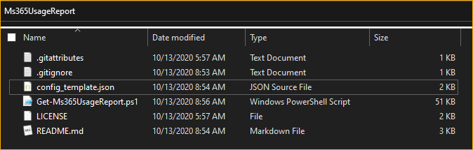<br>Script files

### Files List

- `Get-Ms365UsageReport.ps1` - this is the main script file.
- `config_template.json` - this is the configuration file template.
- `LICENSE` - the license document for this repository.
- `README.md` - this document that you are reading right now.
- `.gitattributes` and `.gitignore` - ignore these files, they don't affect the script.

## Configuration

### Make a New Configuration File

The script uses configuration details from a JSON document. You can have many configuration files with different settings if you want.

To create a new configuration, make a copy of the *config_template.json*. I recommend for you to use your Microsoft 365 tenant domain as the name of the configuration file for easier identification.

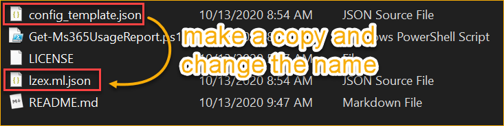<br>Create a copy of the configuration file

> You can use any name for the new configuration file. What's important is the contents, not the file name.

### JSON Settings Explained

Open your JSON file using any text editor. It would be best to use an editor that has syntax/language support like [*Notepad++*](https://notepad-plus-plus.org/downloads/), [*Atom*](https://atom.io/), or [*Visual Studio Code*](https://code.visualstudio.com/).

The code below shows the default content of the configuration JSON file. The meaning of each setting is explained in the next section.

```JSON
{
    "auth": {
        "tenantName": "<tenant>.onmicrosoft.com",
        "msGraphAuthType": "1",
        "msGraphAppID": "",
        "msGraphAppKey": "",
        "msGraphAppCertificateThumbprint": "",
        "exchangeAuthType": "1",
        "exchangeAppID": "",
        "exchangeAppCertificateThumbprint": "",
        "exchangeCredentialFile": ""
    },
    "parameters": {
        "transLog": "1",
        "saveRawData": "1",
        "period": "30"
    },
    "mail": {
        "sendEmail": "1",
        "fromAddress": "sender@domain.com",
        "toAddress": "recipient1@domain.com,recipient2@domain.com",
        "ccAddress": "",
        "bccAddress": ""
    },
    "reports": {
        "license": "1",
        "sharepoint": "1",
        "onedrive": "1",
        "SkypeForBusiness": "1",
        "teams": "1",
        "Office365Groups": "1",
        "exchangeMailbox": "1",
        "exchangeApp": "1",
        "exchangeTopMailTraffic": "1",
        "exchangeMailTraffic": "1",
        "exchangeATPDetections": "1",
        "ms365ActiveUsers": "1",
        "ms365ActivationUsers": "1"
    },
    "developer": {
        "graphApiVersion": "beta",
        "scriptCompatibleVersion": "1.2"
    }
}
```

<hr>

| AUTH                               |                                                                                                                                                                                                                                                                                                                                                                                                                                                                                                                                                                     |
| ---------------------------------- | ------------------------------------------------------------------------------------------------------------------------------------------------------------------------------------------------------------------------------------------------------------------------------------------------------------------------------------------------------------------------------------------------------------------------------------------------------------------------------------------------------------------------------------------------------------------- |
| `tenantName`                       | This is your Microsoft 365 tenant's organization name.<br>Example: `contoso.onmicrosoft.com`                                                                                                                                                                                                                                                                                                                                                                                                                                                                        |
| `msGraphAuthType`                  | Determines the Graph API credential type.<br><br>`"msGraphAuthType": "1"` = Use Certificate to authenticate<br>`"msGraphAuthType": "2"` = Use Client Secret to authenticate                                                                                                                                                                                                                                                                                                                                                                                         |
| `msGraphAppID`                     | This is the registered app's Application ID. (refer to *[Register a New Azure AD App](#register-a-new-azure-ad-app)*).                                                                                                                                                                                                                                                                                                                                                                                                                                              |
| `msGraphAppKey`                    | This is the registered app's Secret Key. (refer to *[Adding a Client Secret](#option-1-adding-a-client-secret)*).                                                                                                                                                                                                                                                                                                                                                                                                                                                   |
| `msGraphAppCertificateThumbprint`  | This is the registered app's Certificate Thumbprint. (refer to *[Creating and Uploading a Self-Signed Certificate*](#option-2-creating-and-uploading-a-self-signed-certificate)*).                                                                                                                                                                                                                                                                                                                                                                                  |
| `exchangeAuthType`                 | Determines the Exchange Credential authentication type.<br><br>`"exchangeAuthType": "1"` = Use Certificate to authenticate<br>`"exchangeAuthType": "2"` = Use Basic Auth (Username+Password) Credential to authenticate                                                                                                                                                                                                                                                                                                                                             |
| `exchangeAppID`                    | This is the registered app's Application ID.<br>Refer to *[Setting Up App-Only Authentication using PowerShell](https://adamtheautomator.com/exchange-online-powershell-mfa/#Setting_Up_AppOnly_Authentication_using_PowerShell)*.<br><br><br>This is only required if you're using If you're using `"exchangeAuthType": "1"`<br>If you're using `"exchangeAuthType": "2"`, you do not need to add a value to this.                                                                                                                                                 |
| `exchangeAppCertificateThumbprint` | This is the registered app's Certificate Thumbprint.<br>Refer to *[Setting Up App-Only Authentication using PowerShell](https://adamtheautomator.com/exchange-online-powershell-mfa/#Setting_Up_AppOnly_Authentication_using_PowerShell)*.<br><br><br>This is only required if you're using If you're using `"exchangeAuthType": "1"`<br><br>Make sure that the certificate is in the personal certificate store and uploaded to the registered Exchange app in Azure AD.<br><br>If you're using `"exchangeAuthType": "2"`, you do not need to add a value to this. |
| `exchangeCredentialFile`           | The file path to the encrypted credential file.<br><br>Refer to: *[Creating an Encrypted Exchange Online Credentials File](#creating-an-encrypted-exchange-online-credentials-file)*<br><br>When you enter the path in the JSON configuration, make sure to use double-backslash.<br><br>Example:<br>`"exchangeCredentialFile": "C:\\temp\\cred.xml"`                                                                                                                                                                                                               |

<hr>

| PARAMETERS    |                                                                                                                               |
| ------------- | ----------------------------------------------------------------------------------------------------------------------------- |
| `transLog`    | Turn ON or OFF the transcript logging. When turned on, the transcript will be saved to the *<script_root>\transcript- folder. |
| `saveRawData` | Turn ON or OFF the saving of raw data. Raw data files are saved to the *<script_root>\reports\<organization name>-            |
| `period`      | The period covered by the report in days. Valid values are: `7`,`30`,`90`,`180`.                                              |

<hr>

| MAIL          |                                                                                                                                                                                                                                                                            |
| ------------- | -------------------------------------------------------------------------------------------------------------------------------------------------------------------------------------------------------------------------------------------------------------------------- |
| `sendEmail`   | Turn ON or OFF the sending of the HTML report by email. The HTML report file is saved to *<script_root>\reports\<organization name>\report.html*<br><br>`"sendEmail": "1"` = ON<br>`"sendEmail": ""` = OFF                                                                 |
| `fromAddress` | This is the email address used for sending the HTML report. This must be a valid mailbox and email address. Using a shared mailbox as the sender is recommend because it does not required an Exchange Online license.<br>Example:<br>`"fromAddress": "sender@domain.com"` |
| `toAddress`   | The recipient(s) email address that will appear in the TO address. Multiple entries are accepted, but must be delimited by a comma ",".<br>Example:<br>`"toAddress": "recipient1@domain.com,recipient2@domain.com"`                                                        |
| `ccAddress`   | The recipient(s) email address that will appear in the CC address. Multiple entries are accepted, but must be delimited by a comma ",".<br>Example: <br>"ccAddress": "recipient1@domain.com,recipient2@domain.com"`                                                        |
| `bccAddress`  | The recipient(s) email address that will appear in the BCC address. Multiple entries are accepted, but must be delimited by a comma ",".<br>Example:<br>`"bccAddress": "recipient1@domain.com,recipient2@domain.com"`                                                      |

<hr>

| REPORTS                  |                                                                                                                                             |
| ------------------------ | ------------------------------------------------------------------------------------------------------------------------------------------- |
| `license`                | Turn ON or OFF the license assignment count report.<br>ON: `"license": "1"` <br>OFF: `"license": ""`                                        |
| `sharepoint`             | Turn ON or OFF the SharePoint Online reports.<br>ON: `"sharepoint": "1"` <br>OFF: `"sharepoint": ""`                                        |
| `onedrive`               | Turn ON or OFF the OneDrive for Business reports.<br>ON: `"onedrive": "1"` <br>OFF: `"onedrive": ""`                                        |
| `SkypeForBusiness`       | Turn ON or OFF the Skype for Business reports.<br>ON: `"SkypeForBusiness": "1"` <br>OFF: `"SkypeForBusiness": ""`                           |
| `teams`                  | Turn ON or OFF the Microsoft Teams report.<br>ON: `"teams": "1"` <br>OFF: `"teams": ""`                                                     |
| `Office365Groups`        | Turn ON or OFF the Microsoft 365 Groups report.<br>ON: `"Office365Groups": "1"` <br>OFF: `"Office365Groups": ""`                            |
| `exchangeMailbox`        | Turn ON or OFF the Exchange Online Mailbox reports.<br>ON: `"exchangeMailbox": "1"` <br>OFF: `"exchangeMailbox": ""`                        |
| `exchangeApp`            | Turn ON or OFF the Exchange Online Email App report.<br>ON: `"exchangeApp": "1"` <br>OFF: `"exchangeApp": ""`                               |
| `exchangeMailTraffic`    | Turn ON or OFF the Exchange Online Mail Traffic reports.<br>ON: `"exchangeMailTraffic": "1"` <br>OFF: `"exchangeMailTraffic": ""`           |
| `exchangeTopMailTraffic` | Turn ON or OFF the Exchange Online Mail Top Traffic reports.<br>ON: `"exchangeTopMailTraffic": "1"` <br>OFF: `"exchangeTopMailTraffic": ""` |
| `exchangeATPDetections`  | Turn ON or OFF the Exchange Online Mail ATP detection reports.<br>ON: `"exchangeATPDetections": "1"` <br>OFF: `"exchangeATPDetections": ""` |
| `ms365ActiveUsers`       | Turn ON or OFF the Office 365 Active Users report.<br>ON: `"ms365ActiveUsers": "1"` <br>OFF: `"ms365ActiveUsers": ""`                       |
| `ms365ActivationUsers`   | Turn ON or OFF the Office 365 Activations by Users report.<br>ON: `"ms365ActivationUsers": "1"` <br>OFF: `"ms365ActivationUsers": ""`       |

<hr>

| DEVELOPER                 |                                                                                                                    |
| ------------------------- | ------------------------------------------------------------------------------------------------------------------ |
| `graphApiVersion`         | **DO NOT CHANGE!!! FOR DEVELOPMENT USE ONLY**.<br>This defines the Microsoft Graph API version used by the script. |
| `scriptCompatibleVersion` | **DO NOT CHANGE!!! FOR DEVELOPMENT USE ONLY**.                                                                     |

## How to Use the Script

### Syntax

The `Get-Ms365UsageReport.ps1` script accepts two (1) mandatory parameter.

- `-Config` - This parameter accepts the path of the [JSON configuration](#configuration) file.

```PowerShell
.\Get-Ms365UsageReport.ps1 -Config <PATH TO JSON FILE>
```

### Running the Script

1. Open PowerShell and change the working directory to where you saved the script.
2. Run the script. In the example below, the configuration file used is *poshlab.ml.json- which is in the same folder as the script.

   ```powershell
   .\Get-Ms365UsageReport.ps1 -config .\poshlab.ml.json
   ```

You should see a screen output similar to the one below.

<br>Running the script

### Script Output

#### Transcript File

If transcript logging is enabled, the transcript is saved to the `transcript` folder.


#### Raw Data and HTML Report Files

If raw data saving is enabled, the raw data files and HTML report is saved to the `reports\[ORGANIZATION]\[REPORT PERIOD]` folder.

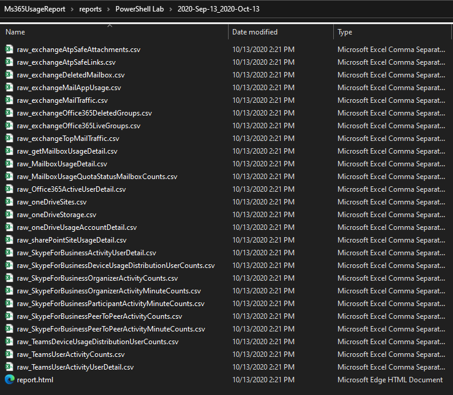

#### HTML Report

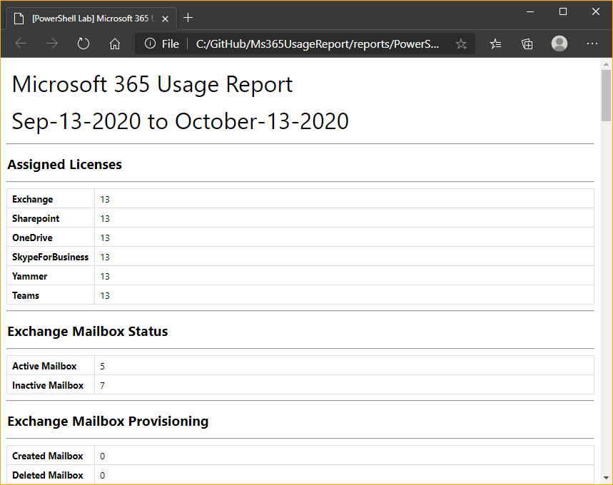

#### Email Report

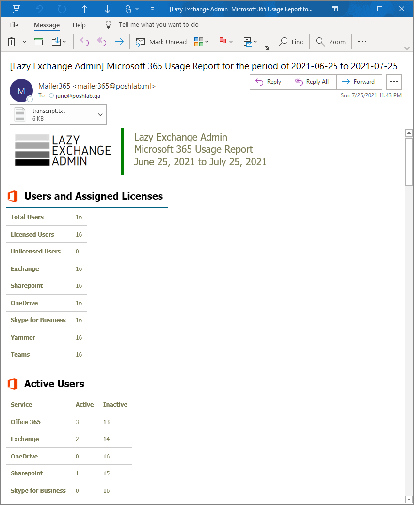

## ANNEX

### Register a New Azure AD App

Go to the [Azure Active Directory admin center](https://aad.portal.azure.com/) and navigate to ***Azure Active Directory > App registrations***. Then, click on **New Registration**.

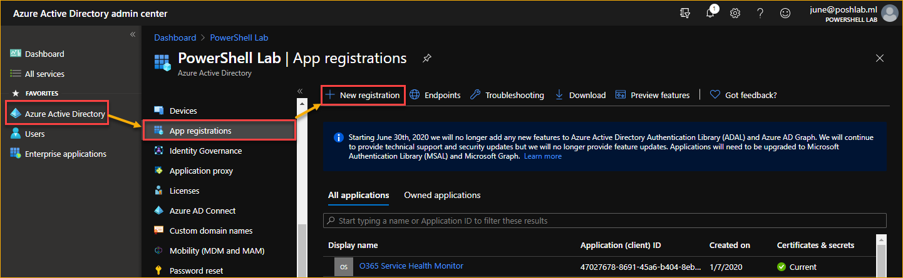

- In the **Name**, type in ***Microsoft 365 Usage Reports***.

- In the **Supported account types**, select ***Accounts in this organizational directory only***.

- In the **Redirect URI (optional)**, select ***Web*** and type in `http://localhost`.

- Click on **Register**.

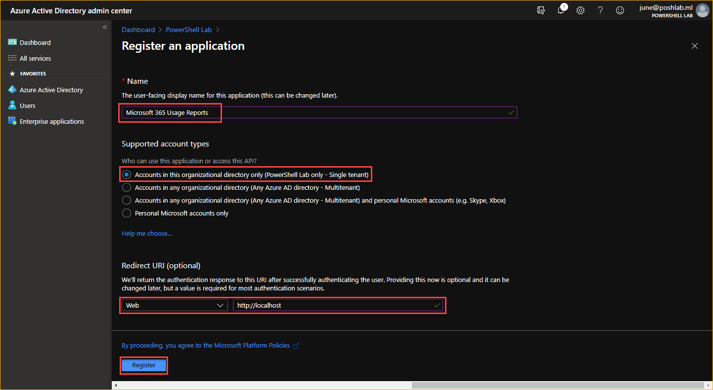

After the App has been registered, copy the **Application (client) ID** and **Directory (tenant) ID**.

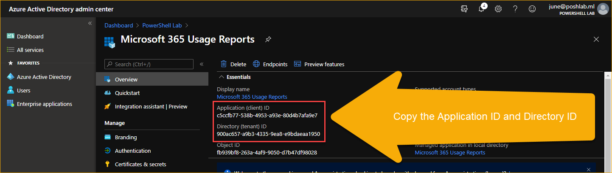

#### Adding the Required API Permissions

Go to **API Permissions** and click on the **Add a Permission** button.

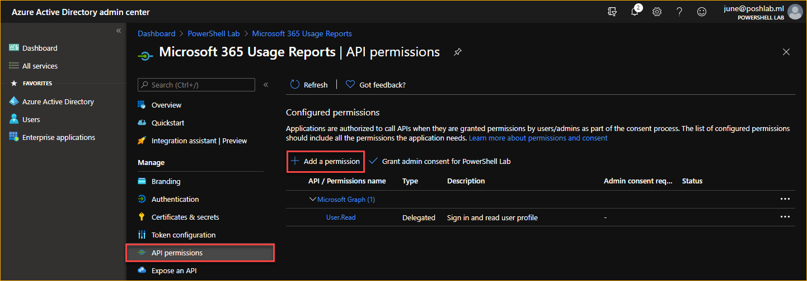

In the **Request API Permission**, select **Microsoft Graph API**.

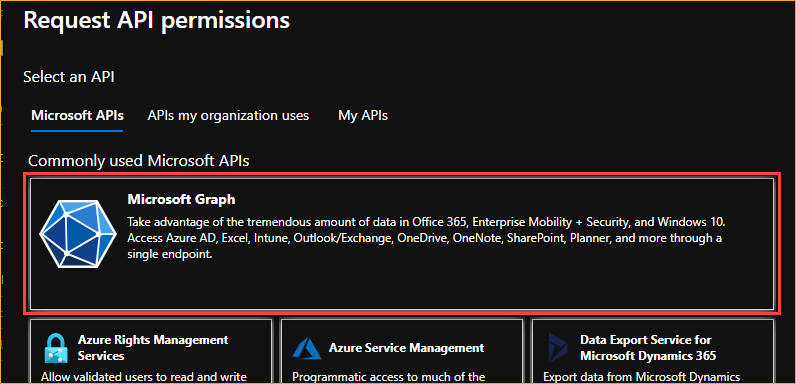

In **What type of permissions does your application require?** click on **Application**.

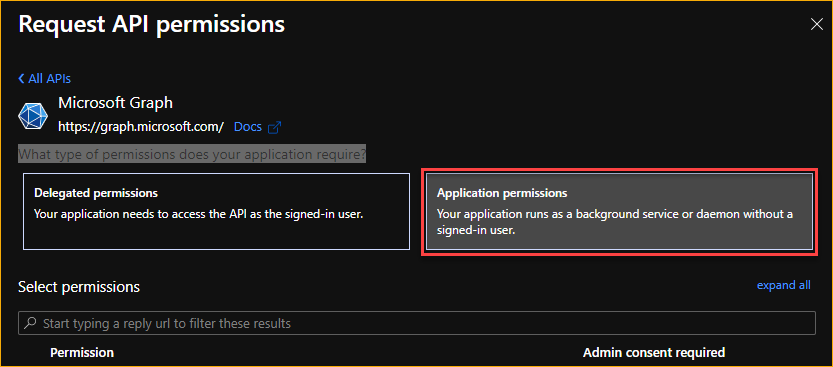

From the list of permissions, search for and enable the following permissions.

- `Reports.Read.All`

- `Directory.Read.All`

- `Mail.Send`

Once you're done selecting the permissions, click on the **Add permissions** button.

Next, you have two options as to how your application can get authorization. Using a ***Client Secret*** or a ***Self-Signed Certificate***.

#### OPTION 1: Adding a Client Secret

> *Note: You can use either a Certificate or a Client Secret for API authentication. This example shows you only how to create a client secret.*

Go to **Certificates & secrets** and click on the **New client secret** button.

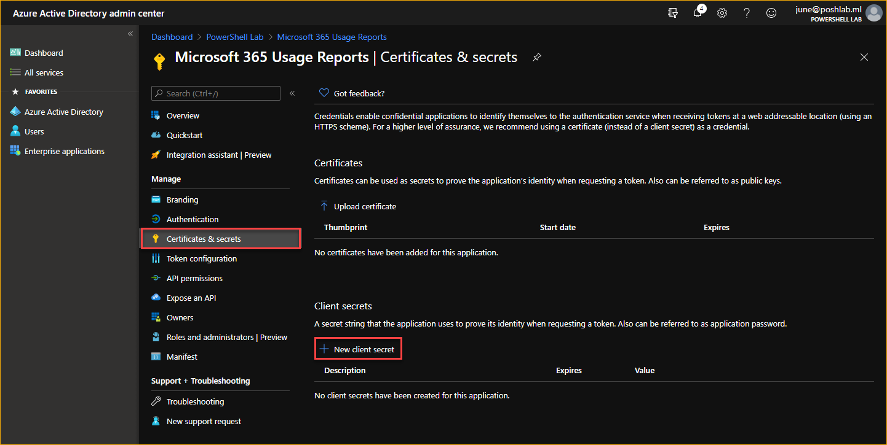

In the **Add a client secret** page:

- Type in the **Description*** box the description you want to use. In this example, the description used is ***secret key 1***.
- Select the validity period for this secret. In this example, the secret key **Expires** <u>***In 2 years***</u>. Choose which ever one is permitted for your organization.
- Click on **Add**.

Make sure to copy and save the key.

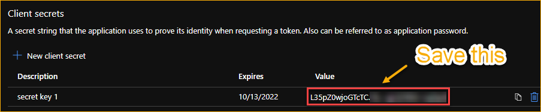

#### OPTION 2: Creating and Uploading a Self-Signed Certificate

> *Note: You can use either a Certificate or a Client Secret for API authentication. This example shows you only how to create a certificate.*

Copy the code below and run it in PowerShell. The script will create a new self-signed certificate in the personal certificate store with a validity of five (5) years. Then, exports the DER-encoded `ms365UsageReport.cer` file to the current working directory.

```PowerShell
# Create a self-sign certificate in the personal certificate store with 5-year validity.
$certSplat = @{
  Subject = 'CN=ms365UsageReport'
  NotBefore = ((Get-Date).AddDays(-1))
  NotAfter = ((Get-Date).AddYears(5))
  CertStoreLocation = "Cert:\CurrentUser\My"
}
$selfSignedCertificate = New-SelfSignedCertificate @certSplat

# Export the certificate (.CER)
Export-Certificate -Cert $selfSignedCertificate -FilePath .\ms365UsageReport.cer
```

After running the code, you can see the new certificate is in the personal certificate store.

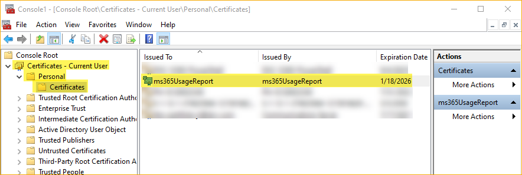<br>
The new self-signed certificate in the personal certificate store

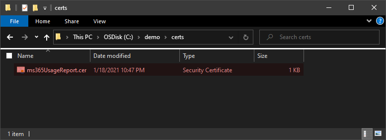<br>
The new self-signed certificate exported to a file

Now that you have the certificate file (.cer), the next step is to upload the certificate to the AzureAd App. Follow these next steps.

1. Go to **Certificates & secrets** and click on the **Upload certificate** button.
2. Click the browse button.
3. Locate the certificate file and click **Open**.
4. Click **Add**.

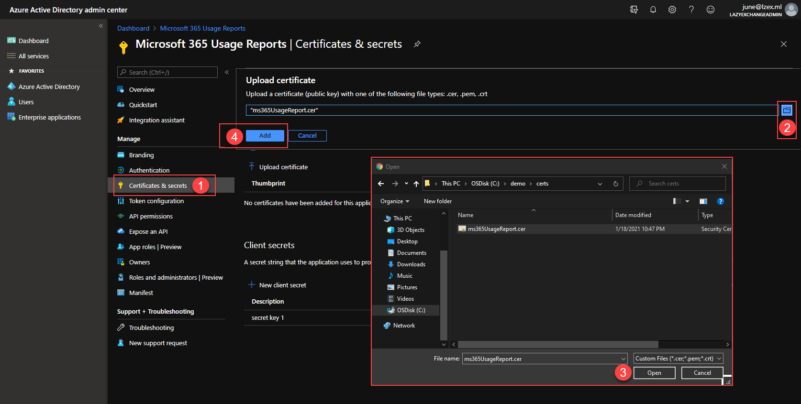<br>Uploading a certificate

You should now see the certificate was uploaded. Copy the **Thumbprint** value.

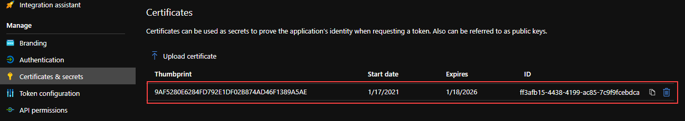<br>The certificate is uploaded

#### Granting Admin Consent

> *Note: Only a Global Admin can grant consent on behalf of the Microsoft 365 Tenant. If you do not have the proper rights, ask your Global Admin to grant the consent.*

You should see that the new API permissions are added, but the status if ***Not granted for [tenant]***. To finish granting the permissions, click on the **Grant admin consent for [tenant]** button.

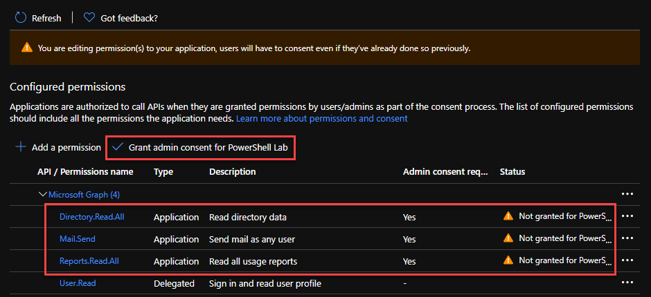

When asked to confirm, click on **Yes**.

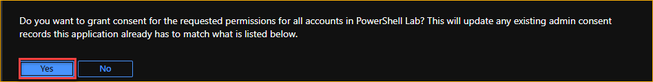

The API permissions status should change to **Granted for [tenant]**

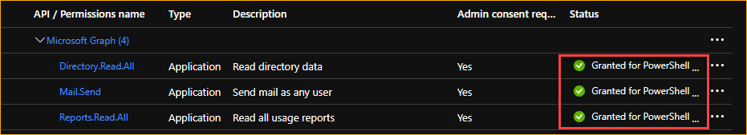

Now you should have the following details available:

- Client ID
- Secret Key
- Tenant ID

### Creating an Encrypted Exchange Online Credentials File

If you're using a username + password to authenticate to Exchange Online, then you'll need to save your encrypted credentials to a file.

1. In PowerShell, enter this command - `Get-Credential | Export-CliXml <PATH\TO\FILE.xml>`.
2. When prompted, enter the username and password of the Exchange Online credential to use.

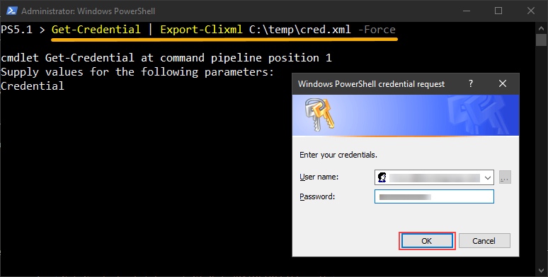<br>Creating an Encrypted Exchange Online Credentials File
